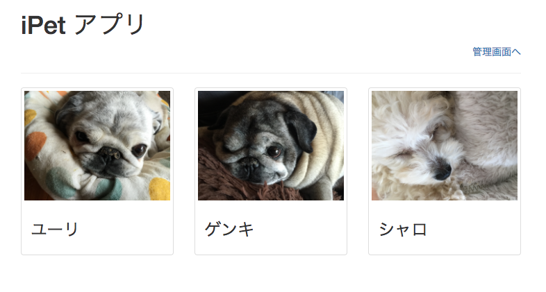
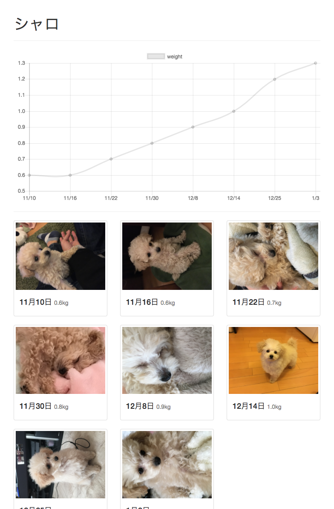
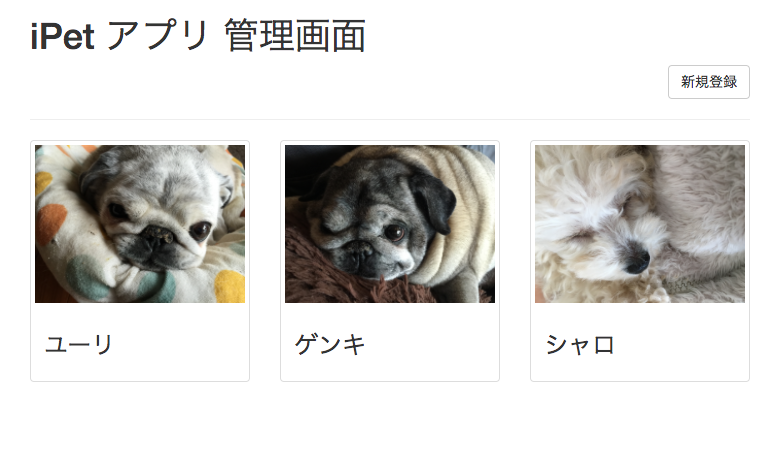
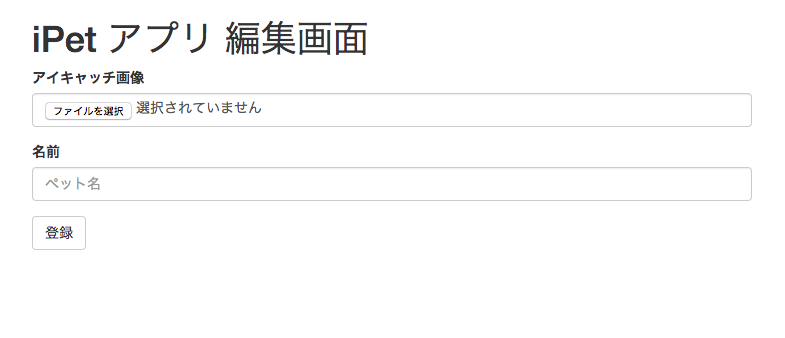
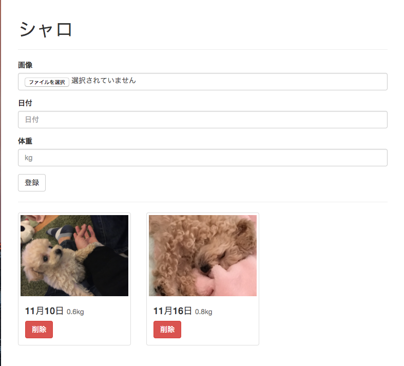

# Webプログラミング演習 試験問題

2017/01/05

下記の仕様に従って Web アプリを開発してください。

## 提出物 & 期限

#### 提出物

- ソースコード一式(zip で圧縮して提出）

#### 期限

- 2017/01/19 23:55

## 仕様

次の仕様を満たすアプリを作成してください。

- データベースを使うこと
- 次に挙げる画面が実装されていること

データベースのテーブル設計は自由に行ってください。

Web アプリ開発は PHP で行い、フレームワーク等の利用は自由に行って構いません。

HTML の製作も必要ですが、デザインは評価ポイントに含めないので、特に気にしなくて構いません。HTML のサンプルがリポジトリに含まれているので、コレを利用して開発を始めて貰って構いません。

### 一覧画面

この画面では、登録されているペットの一覧が表示されます。ペット画像と名前を一覧表示してください。

### 詳細画面

この画面は、一覧で選択したペットのこれまで登録した体重の一覧が表示されます。サンプルでは体重はグラフ表示していますが、これは `Chart.js` というチャート表示用の JavaScript を使って行っています。使い方はサンプルの HTML ファイルを見ればわかると思いますので、是非利用してください。

### 管理画面トップ

ペットを登録する画面です。右上の新規登録で「管理画面-登録画面」へ、登録済みのペットを選択することで「管理画面-編集画面」へ遷移します。

### 管理画面-登録画面

この画面では、ペットの登録を行います。画像と名前を登録できるようにしてください。

### 管理画面-編集画面

この画面では、ペットの体重を登録できるようにしてください。登録済みの体重一覧はページ下部に表示されていて、削除ボタンを押下することで削除出来るようにしてください。

## 参考

- データベースのテーブルは最低2つ必要になります。ペットを保持するテーブルと体重を保持するテーブルの２つです。これらの２つのテーブルを結合できるような構造を考えてください。
- 画像のアップロードがありますが、画像ファイルのバイナリデータを直接データベースに保存しても構いませんし、画像ファイルはファイルとして保存し、データベースにはファイルのパスが導ける情報のみを保持するようにしても構いません